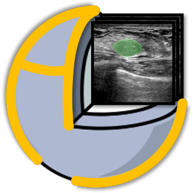
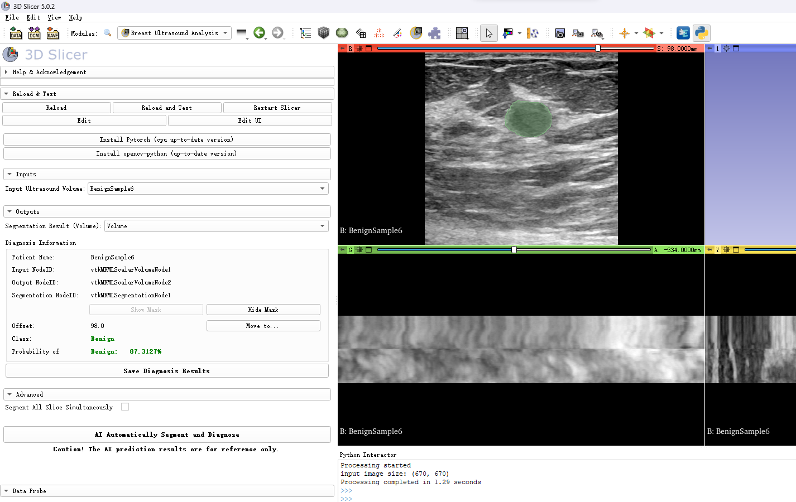
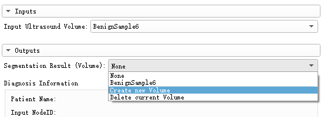
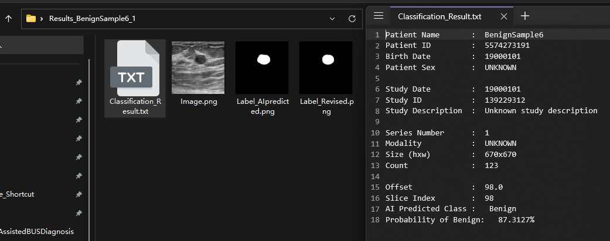

# Breast Ultrasound Analysis Extension for 3D Slicer

This extension currently contains only one module, which has the same name as the extension name.


## Module: Breast Ultrasound Analysis



This module is designed to help physicians diagnose intramammary lesions based on breast ultrasound images with nodules. Based on the DICOM ultrasound image imported into 3D Slicer, this module can segment the nodule from the image and predict whether the nodule is malignant through its built-in AI algorithm.

**Caution! The AI prediction results are not absolutely accurate, and are only for physicians' reference in diagnosis.**

The AI prediction algorithm integrated in this module will be continuously updated in the future.


To enable this module, [PyTorch](https://pytorch.org/) must be installed in your 3D Slicer. **This module will install them automatically when you restart 3D Slicer for the first time after installing this module(so please be patient at that time).** If the automatic installation fails, check that your network connection is available and try entering the following code in Python Interactor: 

```python
slicer.util.pip_install('torch torchvision torchaudio')
```

or (especially for users located in China):

```python
slicer.util.pip_install('torch torchvision torchaudio -i https://pypi.tuna.tsinghua.edu.cn/simple')
```

Please restart 3D Slicer after installation to enable this module.


### Screenshot




### Tutorial

1. Import breast ultrasound images in DICOM format(PNG format is available but not recommended) into 3D Slicer through `Add DICOM Data` module.([SampleData](https://github.com/ZhyBrian/SlicerBreastUltrasoundAnalysis/tree/master/SampleData) is provided in the repository)

2. Jump to `AI Assisted BUS Diagnosis` module and select the ultrasound volume you just imported as the input of the AI prediction algorithm in this module.

3. Select the output volume as the result of AI segmentation(`Create new Volume` is highly recommended).

   

4. Drag the slider in the red slice widget to select a slice which is suitable for diagnosis.

5. Click `AI Automatically Segment and Diagnose` button and wait for several seconds.

6. The results of AI segmentation will be automatically presented in the scene. The `Diagnosis Information` on the left records the patient's name, the ID of the input and output Nodes, the offset of the slice you selected, and the prediction result of AI algorithm (whether the nodule is benign or malignant and its probability).

7. You can revise the segmentation mask predicted by AI in `Segment Editor` Module. After that, you can save all the diagnosis results by clicking `Save Diagnosis Results` button. The saved results include more detailed diagnostic information, the input 2D ultrasound image and the original & revised segmentation mask.

   

- If you checked `Segment All Slice Simultaneously` before clicking `AI Automatically Segment and Diagnose` button, all the slices in the red slice widget will be segmented simultaneously by AI algorithm. It may take several minutes to compute, and the function of classifying breast nodule and saving diagnosis results are unavailable in this mode.
